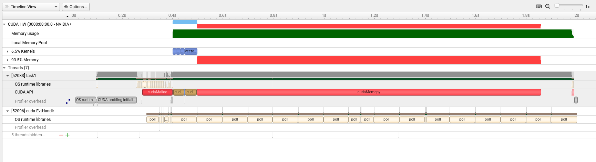
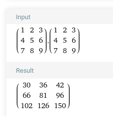

# AK9PV

Veškerý kód byl kompilován pod Linux a funkčnost ověřena na lokální grafické kartě RTX 4060Ti 16GB (nVidia compute capability 8.9).

# Task 1

> 1. Pomocí jazyka C/C++, CUDA API a vhodných vývojových nástrojů (CUDA Online IDE, NVIDIA NSight, CodeLite+SSH,...) vytvořte aplikaci implementující paralelní součet prvků dvou vektorů o velikosti n inicializovaných na hodnoty 1 - n. Hodnotu n volte v řádech stovek až tisíců.
> 2. Ověřte funkcionalitu na vzdáleném překladovém serveru a GPGPU Tesla K40.
> 3. Otestujte možnosti debuggingu CUDA kernelů, tj. vložení breakpointu do kernelu a jeho krokování (vyžaduje IDE NSight a dodatečnou grafickou kartu).
> 4. Otestujte možnosti profilingu CUDA kernelů, tj. spuštění vzdálené aplikace v prostředí NSight Visual Profiler (vyžaduje IDE NSight).

K debuggingu jsem využil konzolového nástroje cuda-gdb, umožňuje v kódu umístit breakpointy a následně průběh programu krokovat. IDE, které jsem použil bohužel nepodporuje CUDA debugging a ve VS Code se mi ho nepodařilo zprovoznit. Debugging přímo v IDE je podstatně užitečnější a umožňuje přístup k proměnným bez nutnosti je "pollovat" přes CLI.

Pro zajímavější výstup profilingu jsem musel zvolit ještě vyšší řád než bylo zadáno (10^9), aby se projevily dopady. Vektory jsem plnil přímo na GPU, při plnění na CPU se 80-90 % programu odehrávalo na CPU. Celkové využití RAM přesáhlo 11GB. Pro moji verzi GK zatím není možné využít sběru GPU metrik. 


# Task 2 - Násobení matic v globální paměti

> 1. Pomocí jazyka C/C++, CUDA API a vhodných vývojových nástrojů (CUDA Online IDE, NVIDIA NSight, CodeLite+SSH,...) vytvořte aplikaci implementující paralelní násobení matic A a B o vhodné velikosti inicializovaných lexikograficky na hodnoty 1 - n, kde n je celkový počet prvků matice.
> 2. Volte triviální algoritmus bez optimalizace přístupů do globální paměti pomocí využití sdílené paměti.
> 3. Ověřte funkcionalitu na vzdáleném překladovém serveru a GPGPU Tesla K40.
> 4. Správnost výpočtu ověřte pomocí vhodného SW/nástroje (Matlab, SciLab, Octave, ...).

Pro ověření správnosti výpočtu je možné v kódu definovat N=3 a v takovém případě je vypsány vstupní matice A a B a výsledek matice C. Jinak je nastaveno N=1024

Výstup konzole:
```
Matice A:
1 2 3 
4 5 6 
7 8 9 

Matice B:
1 2 3 
4 5 6 
7 8 9 

Matice C:
30 36 42 
66 81 96 
102 126 150 
```
Výsledek podle [Wolfram Alpha](https://www.wolframalpha.com/input?i=matrix+multiplication&assumption=%7B%22F%22%2C+%22MatricesOperations%22%2C+%22theMatrix2%22%7D+-%3E%22%7B%7B1%2C2%2C3%7D%2C%7B4%2C5%2C6%7D%2C%7B7%2C8%2C9%7D%7D%22&assumption=%7B%22F%22%2C+%22MatricesOperations%22%2C+%22theMatrix1%22%7D+-%3E%22%7B%7B1%2C2%2C3%7D%2C%7B4%2C5%2C6%7D%2C%7B7%2C8%2C9%7D%7D%22&assumption=%7B%22C%22%2C+%22matrix+multiplication%22%7D+-%3E+%7B%22Calculator%22%2C+%22dflt%22%7D):



# Task 3 - Zpracování obrazu pomocí 2D konvoluce
> Zadání:
> 
> 1. Pomocí jazyka C/C++, CUDA API a vhodných vývojových nástrojů (NVIDIA NSight, CodeLite+SSH,...) vytvořte aplikaci umožňující provádět vybrané operace nad 2D obrazem (rozostření, detekce hran, ...) pomocí algoritmu diskrétní 2D konvoluce.
> 2. Volte 3-kanálový (R,G,B) triviální algoritmus s optimalizací přístupů do globální paměti pomocí využití sdílené paměti.
> 3. Jako zdroj dat použijte libovolný vhodný obrázek ve formátu PNG. Modifikovaný výstup ukládejte ve stejném formátu. Pro přesun obrázků mezi lokální pracovní stanicí a výpočetním GPU serverem použijte možnosti CUDA Online IDE, nástroj git integrovaný do IDE NSight nebo manuální kopírování pomocí SSH/SCP.
> 4. Pro přístup k jednotlivým barevným kanálům obrázku (R,G,B) použijte knihovnu libpng++ (viz. Utility) nebo jiné podobné,
Ověřte funkcionalitu na vzdáleném překladovém serveru a GPGPU Tesla K40.
> 
> Tipy pro řešení:
> 
> 5. Aplikaci implementujte s konzolovým UI.
> 6. Soubory *.cu musí obsahovat pouze obecný a CUDA kód. Volání knihoven třetích stran neobsahující CUDA API musí být v > souborech s příponou *.cpp.
> 7. Pokud není na virtuální stanici s Ubuntu instalována knihovna libpng++, nainstalujte ji pomocí příkazu apt-get install libpng++-dev

Jako vstupní obrázek jsem zvolil vlastní tvorbu ze Stable Diffusion. Jako konvoluční algoritmy jsem zvolil rozostření a detekci hran, navíc jsem přidal i další možnosti manipulace s obrazem (zašumění, černobílá). Volba algoritmu je pomocí konzolového UI a výstup se ukladá do souboru pojmenovaného dle zvolené operace.


Vstupní obraz x Výstupní obraz - rozostření


Vstupní obraz x Výstupní obraz - detekce hran


Vstupní obraz x Výstupní obraz - zašumění


Vstupní obraz x Výstupní obraz - černobílá