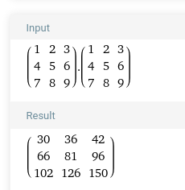

# Task 2 - Násobení matic v globální paměti

> 1. Pomocí jazyka C/C++, CUDA API a vhodných vývojových nástrojů (CUDA Online IDE, NVIDIA NSight, CodeLite+SSH,...) vytvořte aplikaci implementující paralelní násobení matic A a B o vhodné velikosti inicializovaných lexikograficky na hodnoty 1 - n, kde n je celkový počet prvků matice.
> 2. Volte triviální algoritmus bez optimalizace přístupů do globální paměti pomocí využití sdílené paměti.
> 3. Ověřte funkcionalitu na vzdáleném překladovém serveru a GPGPU Tesla K40.
> 4. Správnost výpočtu ověřte pomocí vhodného SW/nástroje (Matlab, SciLab, Octave, ...).

Pro ověření správnosti výpočtu je možné v kódu definovat N=3 a v takovém případě je vypsány vstupní matice A a B a výsledek matice C. Jinak je nastaveno N=1024

Výstup konzole:
```
Matice A:
1 2 3 
4 5 6 
7 8 9 

Matice B:
1 2 3 
4 5 6 
7 8 9 

Matice C:
30 36 42 
66 81 96 
102 126 150 
```
Výsledek podle [Wolfram Alpha](https://www.wolframalpha.com/input?i=matrix+multiplication&assumption=%7B%22F%22%2C+%22MatricesOperations%22%2C+%22theMatrix2%22%7D+-%3E%22%7B%7B1%2C2%2C3%7D%2C%7B4%2C5%2C6%7D%2C%7B7%2C8%2C9%7D%7D%22&assumption=%7B%22F%22%2C+%22MatricesOperations%22%2C+%22theMatrix1%22%7D+-%3E%22%7B%7B1%2C2%2C3%7D%2C%7B4%2C5%2C6%7D%2C%7B7%2C8%2C9%7D%7D%22&assumption=%7B%22C%22%2C+%22matrix+multiplication%22%7D+-%3E+%7B%22Calculator%22%2C+%22dflt%22%7D):

