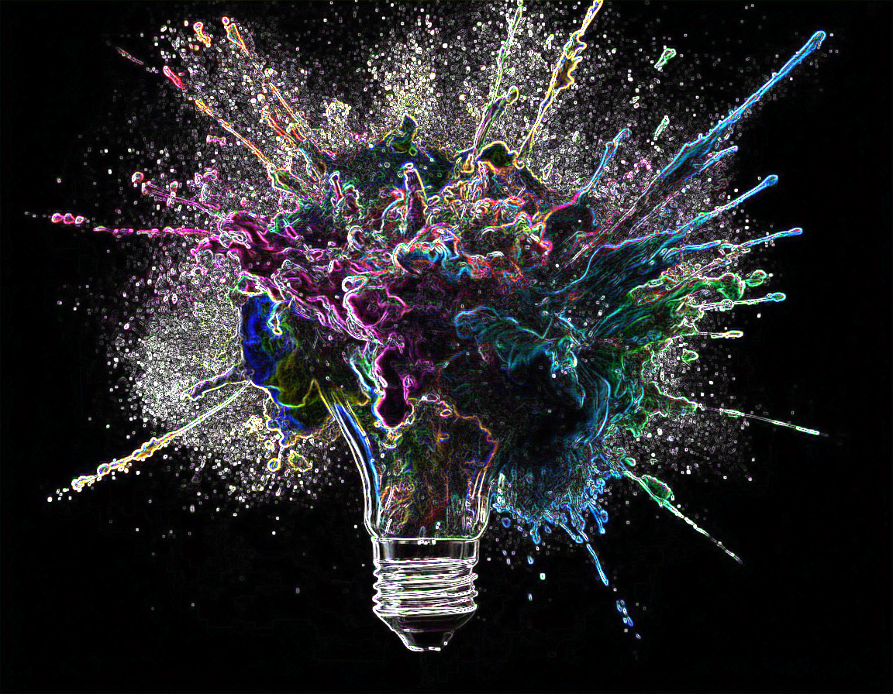

# Task 3 - Zpracování obrazu pomocí 2D konvoluce
> Zadání:
>
> 1. Pomocí jazyka C/C++, CUDA API a vhodných vývojových nástrojů (NVIDIA NSight, CodeLite+SSH,...) vytvořte aplikaci umožňující provádět vybrané operace nad 2D obrazem (rozostření, detekce hran, ...) pomocí algoritmu diskrétní 2D konvoluce.
> 2. Volte 3-kanálový (R,G,B) triviální algoritmus s optimalizací přístupů do globální paměti pomocí využití sdílené paměti.
> 3. Jako zdroj dat použijte libovolný vhodný obrázek ve formátu PNG. Modifikovaný výstup ukládejte ve stejném formátu. Pro přesun obrázků mezi lokální pracovní stanicí a výpočetním GPU serverem použijte možnosti CUDA Online IDE, nástroj git integrovaný do IDE NSight nebo manuální kopírování pomocí SSH/SCP.
> 4. Pro přístup k jednotlivým barevným kanálům obrázku (R,G,B) použijte knihovnu libpng++ (viz. Utility) nebo jiné podobné,
     Ověřte funkcionalitu na vzdáleném překladovém serveru a GPGPU Tesla K40.
>
> Tipy pro řešení:
>
> 5. Aplikaci implementujte s konzolovým UI.
> 6. Soubory *.cu musí obsahovat pouze obecný a CUDA kód. Volání knihoven třetích stran neobsahující CUDA API musí být v > souborech s příponou *.cpp.
> 7. Pokud není na virtuální stanici s Ubuntu instalována knihovna libpng++, nainstalujte ji pomocí příkazu apt-get install libpng++-dev

Jako vstupní obrázek jsem zvolil vlastní tvorbu ze Stable Diffusion. Jako konvoluční algoritmy jsem zvolil rozostření a detekci hran, navíc jsem přidal i další možnosti manipulace s obrazem (zašumění, černobílá). Volba algoritmu je pomocí konzolového UI a výstup se ukladá do souboru pojmenovaného dle zvolené operace.

Vstupní obraz x Výstupní obraz - rozostření

Vstupní obraz x Výstupní obraz - detekce hran

Vstupní obraz x Výstupní obraz - zašumění

Vstupní obraz x Výstupní obraz - černobílá